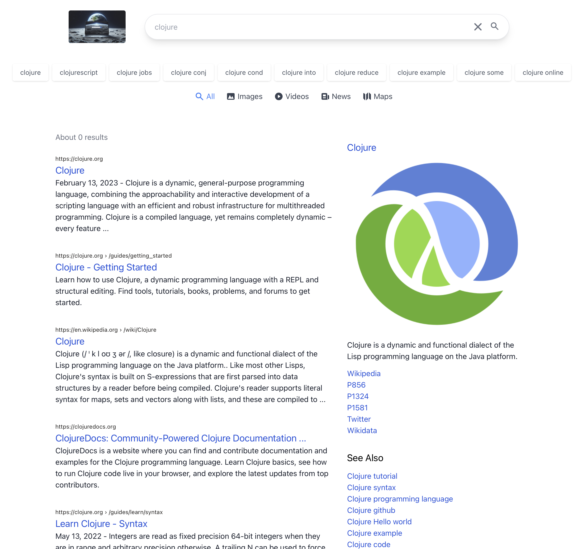

# re-search

A minimalist alternative [SearXNG](https://github.com/searxng/searxng) frontend as an SPA app written in ClojureScript with re-frame and Tailwind.

This project is in early development and lacks many of the functionalities you need for a daily search engine.

## Features:

- Web Search
- Responsive UI
- Basic Image search
- Basic Video search
- Basic News search
- Search suggestions
- Image previews in search results
- Search cards and "See Also"
- Basic doodle generation with OpenAI

## What's missing?

- Pagination
- Maps

## Dev Setup Requirements:

1. The re-frame toolset: node.js, npm, leiningen https://github.com/day8/re-frame-template
2. A live running instance of SearXNG configured with CORS

You can follow the instructions on my blog to get one running using nixos and tailscale:

https://www.gbuisson.com/setup_your_own_search_engine.html

## Quick dev setup:

1. Clone the repository `git@github.com:gbuisson/re-search.git`

2. Edit `src/re-search/config.cljs` and override `searx-api-base-url` to point to your base SearXNG hostname.

3. run `npm install`

4. run `npx shadow-cljs watch app`

5. access the app on `http://localhost:8280`
